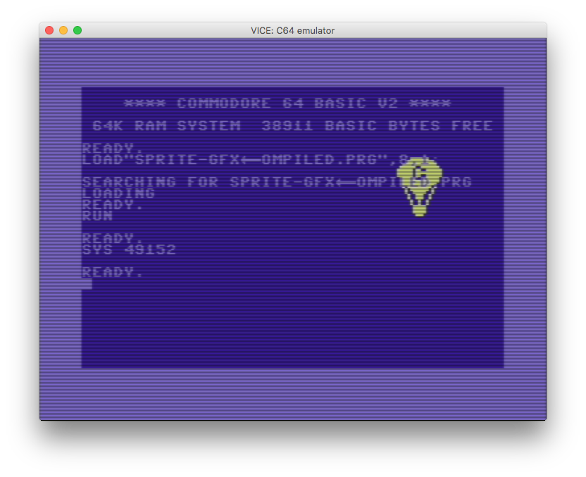

# Sprite Graphics

Tutorial on Sprite Graphics with the famous baloon sprite from the Programmer's Reference. 

Note the sprite data is defined into list structure as string then converted into byte values and finally copied into memory.